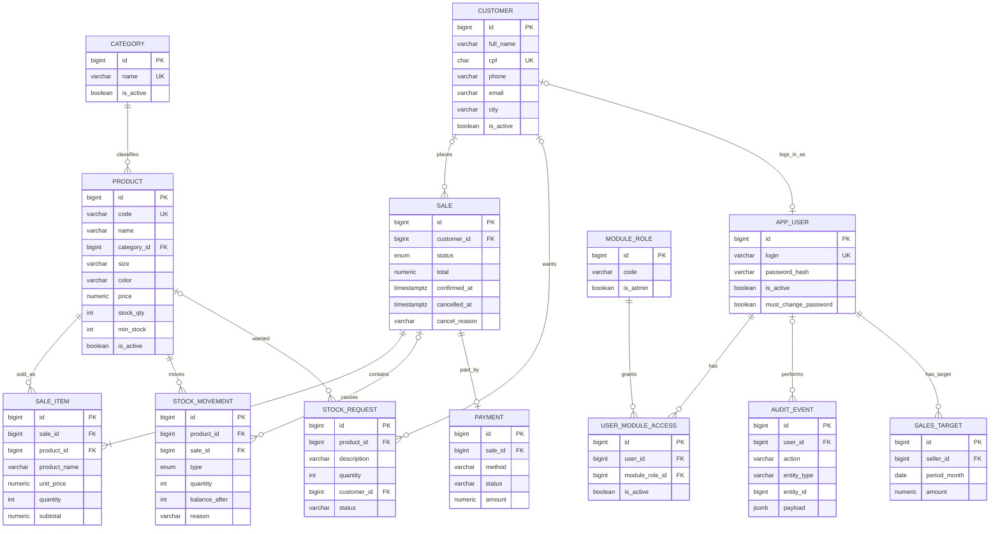

# Modelo de dados (ERD)

```mermaid
erDiagram
  CATEGORY ||--o{ PRODUCT : classifies
  CUSTOMER |o--o{ SALE : places
  SALE ||--|{ SALE_ITEM : contains
  PRODUCT ||--o{ SALE_ITEM : sold_as
  PRODUCT ||--o{ STOCK_MOVEMENT : moves
  SALE |o--o{ STOCK_MOVEMENT : causes
  APP_USER ||--o{ USER_MODULE_ACCESS : has
  MODULE_ROLE ||--o{ USER_MODULE_ACCESS : grants
  APP_USER |o--o{ AUDIT_EVENT : performs
  APP_USER ||--o{ SALES_TARGET : has_target
  PRODUCT |o--o{ STOCK_REQUEST : wanted
  CUSTOMER |o--o{ STOCK_REQUEST : wants
  SALE ||--o| PAYMENT : paid_by
  CUSTOMER |o--o| APP_USER : logs_in_as
  CATEGORY {
    bigint id PK
    varchar name UK
    boolean is_active
  }
  CUSTOMER {
    bigint id PK
    varchar full_name
    char cpf UK
    varchar phone
    varchar email
    varchar city
    boolean is_active
  }
  PRODUCT {
    bigint id PK
    varchar code UK
    varchar name
    bigint category_id FK
    varchar size
    varchar color
    numeric price
    int stock_qty
    int min_stock
    boolean is_active
  }
  SALE {
    bigint id PK
    bigint customer_id FK
    enum status
    numeric total
    timestamptz confirmed_at
    timestamptz cancelled_at
    varchar cancel_reason
  }
  SALE_ITEM {
    bigint id PK
    bigint sale_id FK
    bigint product_id FK
    varchar product_name
    numeric unit_price
    int quantity
    numeric subtotal
  }
  STOCK_MOVEMENT {
    bigint id PK
    bigint product_id FK
    bigint sale_id FK
    enum type
    int quantity
    int balance_after
    varchar reason
  }
  APP_USER {
    bigint id PK
    varchar login UK
    varchar password_hash
    boolean is_active
    boolean must_change_password
  }
  MODULE_ROLE {
    bigint id PK
    varchar code
    boolean is_admin
  }
  USER_MODULE_ACCESS {
    bigint id PK
    bigint user_id FK
    bigint module_role_id FK
    boolean is_active
  }
  AUDIT_EVENT {
    bigint id PK
    bigint user_id FK
    varchar action
    varchar entity_type
    bigint entity_id
    jsonb payload
  }
  PAYMENT {
    bigint id PK
    bigint sale_id FK
    varchar method
    varchar status
    numeric amount
  }
  STOCK_REQUEST {
    bigint id PK
    bigint product_id FK
    varchar description
    int quantity
    bigint customer_id FK
    varchar status
  }
  SALES_TARGET {
    bigint id PK
    bigint seller_id FK
    date period_month
    numeric amount
  }
```

Detalhes, dicionário e scripts: docs/02-modelo-de-dados.md e as migrations em crm-loja-backend/src/main/resources/db/migration.
